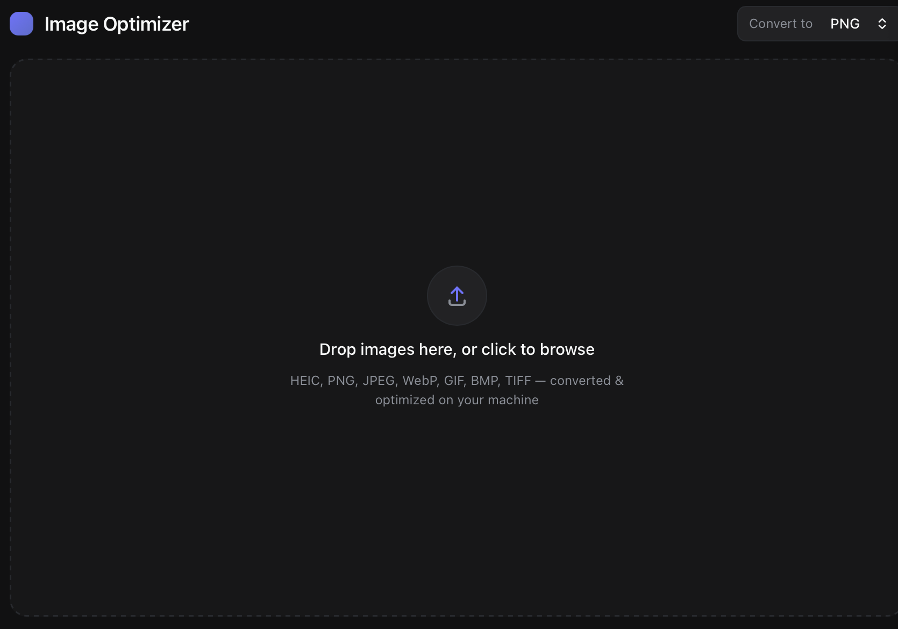

# Image Optimizer

A small, fast desktop app for optimizing images and converting between formats —
including HEIC (iPhone photos) → PNG/JPEG/WebP — by dragging and dropping files
onto the window. Built with [Tauri](https://tauri.app) (Rust) + Svelte for a tiny,
native-feeling app instead of a bundled-Chromium Electron app.



## Stack

- **Tauri v2** — Rust backend, native OS webview (small binaries, low memory)
- **Svelte 5 / SvelteKit** (SPA mode) — UI
- **[`image`](https://github.com/image-rs/image)** — decode/encode PNG, JPEG, WebP, GIF, BMP, TIFF
- **[`heic`](https://github.com/imazen/heic)** — pure-Rust HEIC/HEIF decoder (no C deps)
- **[`oxipng`](https://github.com/oxipng/oxipng)** — lossless PNG recompression pass

## Develop

```bash
npm install
npm run tauri dev
```

## Test

```bash
cd src-tauri && cargo test
```

## Design

The UI is a small Linear-inspired dark-mode design system (`src/lib/tokens.css`)
with motion designed to represent each stage of the image pipeline: a staggered
"pop + settle" entrance for dropped files, a shimmer "scan" while decoding/converting,
a progress fill that crossfades from accent-tint to accent, and a checkmark pop on
completion.

## License

The `heic` crate this project depends on is licensed AGPL-3.0-only (or a commercial
license from Imazen). Accordingly, this project is open source under AGPL-3.0 — see
[LICENSE](LICENSE).
